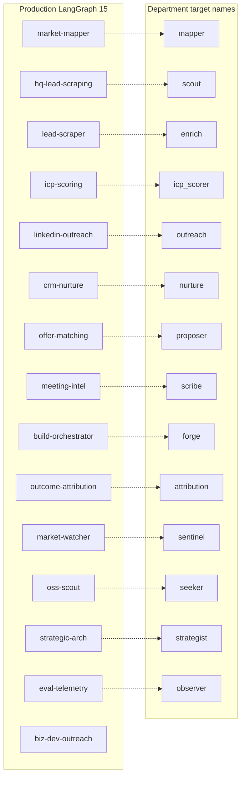
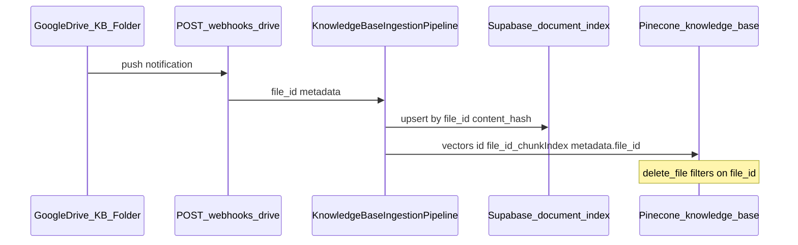

# Omerion KB Transition — Phase 1 Codebase Answers (Q1–Q5)

**Scope:** Read-only audit of `/Users/evy/Desktop/OMERION AI EMPLOYEES`. Cowork has not modified KB documents.

---

## Q1 — The 15-Agent Roster + WAT Layer Map

### FINDINGS — Count reconciliation (do not gloss over)

| Source | Count | What it counts |
|--------|------:|----------------|
| Founder statement | **15** | Operational “AI employees” under WAT |
| [BACKEND_AGENT_INVENTORY.md](BACKEND_AGENT_INVENTORY.md) | **15 live** | LangGraph skills with Discord routing (as of 2026-05-18) |
| Fiverr Hiring Guide (KB) | **14** | **Stale** — predates Agent #15 |
| [omerion/main.py](omerion/main.py) L9, [omerion/omerion_core/__init__.py](omerion/omerion_core/__init__.py) L3, [0002_core_tables.sql](omerion/infra/supabase/migrations/0002_core_tables.sql) L3 | **14** | **Stale comments** — written before `biz-dev-outreach` |
| [discord/omerion_bot.py](discord/omerion_bot.py) L60–65 | **15 skills listed** but autocomplete still includes deprecated `job-seeker` instead of `biz-dev-outreach` |
| [omerion/agents/__init__.py](omerion/agents/__init__.py) | **18** `register()` imports | 15 “core” + 3 Phase-5-style agents already wired |
| [departments/*/department_config.yaml](departments/) | **26** `AgentSpec` entries | Target WAT architecture; mostly **not** the Discord production path |
| [dashboard/src/data/agents.ts](dashboard/src/data/agents.ts) | **27 seats** (0–26) | UI target; many `planned: true` |

**Verdict on true count:** **15 operational backend agents** per [BACKEND_AGENT_INVENTORY.md](BACKEND_AGENT_INVENTORY.md). The **15th** is `biz-dev-outreach` (renamed from `job_seeker` in Phase 2). **14** appears in older docs/migrations/comments and in the Fiverr guide. **18** is registered in code today (includes `client-onboarding`, `client-success`, `competitive-intel` that inventory labels “Phase 5”). **26/27** is the forward-looking department/dashboard roster, not what runs in Discord today.

**WAT definitions used (from [scripts/check_wat.py](scripts/check_wat.py) + repo layout):**
- **Workflow** — multi-step orchestration: LangGraph `graph.py`, [workflows/*.md](workflows/), n8n recipes, event-broker handoffs
- **Agent** — skill-bound autonomous unit: `omerion/skills/*.skill.md` + handler (`omerion/agents/*` today; `departments/*` target)
- **Tool** — deterministic I/O: `tools.py`, `omerion_core/clients/*`, [tools/](tools/)
- **Cross-Layer** — primarily routes other agents/workflows (e.g. build orchestrator, planned ARIA)

### Production roster table (15 live — primary answer for Cowork)

| Agent name | Aliases | Role (one sentence) | WAT layer | Definition path(s) | KB / Drive docs at runtime |
|------------|---------|---------------------|-----------|-------------------|---------------------------|
| **MAP** — Market Mapper | `market-mapper`, Agent #1 | Discovers and classifies target accounts into persona taxonomy; emits `account.batch.ready`. | Workflow + Agent | [omerion/agents/market_mapper/](omerion/agents/market_mapper/), [omerion/skills/market-mapper.skill.md](omerion/skills/market-mapper.skill.md), [omerion/config/agents.yaml](omerion/config/agents.yaml) L135–156 | **None from Drive KB.** Config: `agents.yaml` → `market_mapper.*`; no Pinecone `knowledge-base` query in code. |
| **SOURCE** — HQ Lead Scraping | `hq-lead-scraping`, Agent #2 | Deep-research dossiers per priority account with HITL gate. | Workflow + Agent | [omerion/agents/high_quality_lead_scraping/](omerion/agents/high_quality_lead_scraping/), [omerion/skills/high-quality-lead-scraping.skill.md](omerion/skills/high-quality-lead-scraping.skill.md) | Supabase `accounts` / `research_dossiers`; Pinecone `dossiers` namespace — not Drive doc IDs. |
| **FIND** — Lead Scraper & Enricher | `lead-scraper`, Agent #3 | Contact discovery + enrichment per account. | Workflow + Agent | [omerion/agents/lead_scraper_enricher/](omerion/agents/lead_scraper_enricher/), [omerion/skills/lead-scraper-enricher.skill.md](omerion/skills/lead-scraper-enricher.skill.md) | Apollo/Hunter/etc. per `agents.yaml` L189–201; **no Drive KB**. |
| **SCORE** — ICP Scoring | `icp-scoring`, Agent #4 | Fit × Intent × Timing scoring and shortlist. | Workflow + Agent | [omerion/agents/icp_scoring/](omerion/agents/icp_scoring/), [omerion/skills/icp-scoring.skill.md](omerion/skills/icp-scoring.skill.md) | Pinecone `emails` namespace for intent ([icp_scoring/tools.py](omerion/agents/icp_scoring/tools.py)); persona templates in `agents.yaml` L291–331. |
| **REACH** — LinkedIn Outreach | `linkedin-outreach`, Agent #5 | LinkedIn sequences with persona templates and caps. | Workflow + Agent | [omerion/agents/linkedin_outreach/](omerion/agents/linkedin_outreach/), [omerion/skills/linkedin-outreach.skill.md](omerion/skills/linkedin-outreach.skill.md) | Pinecone `outreach_signals`; templates under `agents/linkedin_outreach/templates/`. |
| **NURTURE** — CRM Nurture | `crm-nurture`, Agent #6 | Email/SMS nurture + ghost sequences. | Workflow + Agent | [omerion/agents/crm_nurture/](omerion/agents/crm_nurture/), [omerion/skills/crm-nurture.skill.md](omerion/skills/crm-nurture.skill.md) | Pinecone `outreach_signals` ([agents.yaml](omerion/config/agents.yaml) L284–287). |
| **MATCH** — Offer Matching | `offer-matching`, Agent #7 | Maps hot contacts to consulting packages + demo references. | Workflow + Agent | [omerion/agents/offer_matching/](omerion/agents/offer_matching/), [omerion/skills/offer-matching.skill.md](omerion/skills/offer-matching.skill.md) | `offer_packages` / `demo_catalog` in [agents.yaml](omerion/config/agents.yaml) L86–133. |
| **INTEL** — Meeting Intelligence | `meeting-intel`, Agent #8 | Fireflies/transcript → W5H + proposal blueprint. | Workflow + Agent | [omerion/agents/meeting_intelligence/](omerion/agents/meeting_intelligence/), [omerion/skills/meeting-intelligence.skill.md](omerion/skills/meeting-intelligence.skill.md) | Pinecone `transcripts`; W5H rubric in `agents.yaml` L340–372. |
| **ORCH** — Build Orchestrator | `build-orchestrator`, Agent #9 | Blueprint → tasks, GitHub PRs, optional client Google Docs. | **Cross-Layer** | [omerion/agents/build_orchestrator/](omerion/agents/build_orchestrator/), [omerion/skills/build-orchestrator.skill.md](omerion/skills/build-orchestrator.skill.md) | Client **Drive folder** via `GOOGLE_CLIENT_DELIVERABLES_FOLDER_ID` ([agents.yaml](omerion/config/agents.yaml) L374–388) — **not** Knowledge Base folder. |
| **ATTRIB** — Outcome Attribution | `outcome-attribution`, Agent #10 | Pre/post attribution and feedback into scoring/templates. | Workflow + Agent | [omerion/agents/outcome_attribution/](omerion/agents/outcome_attribution/), [omerion/skills/outcome-attribution.skill.md](omerion/skills/outcome-attribution.skill.md) | Supabase outcomes tables; persona KPIs from `agents.yaml`. |
| **R1 / WATCH** — Market/Tech Watcher | `market-watcher` | RSS → tagged R&D insights → Pinecone `rd_insights`. | Workflow + Agent | [omerion/agents/r1_market_tech_watcher/](omerion/agents/r1_market_tech_watcher/), [omerion/skills/r1-market-tech-watcher.skill.md](omerion/skills/r1-market-tech-watcher.skill.md) | RSS URLs in [agents.yaml](omerion/config/agents.yaml) L404–454 (already general-industry feeds). |
| **R2 / OSS** — OSS Scout | `oss-scout` | Evaluates OSS repos for integration patterns. | Workflow + Agent | [omerion/agents/r2_oss_scout/](omerion/agents/r2_oss_scout/), [omerion/skills/r2-oss-scout.skill.md](omerion/skills/r2-oss-scout.skill.md) | GitHub search tags in `agents.yaml` L456–472. |
| **R3 / ARCH** — Strategic Architect | `strategic-arch` | Synthesizes signals into design proposals + HITL. | Workflow + Agent | [omerion/agents/r3_strategic_architect/](omerion/agents/r3_strategic_architect/), [omerion/skills/r3-strategic-architect.skill.md](omerion/skills/r3-strategic-architect.skill.md) | Supabase `rd_proposals`; consumes R1/R2 outputs. |
| **R4 / EVAL** — Evaluation & Telemetry | `eval-telemetry`, GUARD | Regression detection across agent runs. | Workflow + Agent | [omerion/agents/r4_evaluation_telemetry/](omerion/agents/r4_evaluation_telemetry/), [omerion/skills/r4-evaluation-telemetry.skill.md](omerion/skills/r4-evaluation-telemetry.skill.md) | `agent_telemetry` / performance tables. |
| **BIZ** — Biz Dev Outreach | `biz-dev-outreach`, formerly `job-seeker` | Finds consulting gigs via job boards; drafts applications (HITL). | Workflow + Agent | [omerion/agents/biz_dev_outreach/](omerion/agents/biz_dev_outreach/), [omerion/skills/biz-dev-outreach.skill.md](omerion/skills/biz-dev-outreach.skill.md) | [omerion/assets/evykynn/resume.md](omerion/assets/evykynn/resume.md), [cover_letter.md](omerion/assets/evykynn/cover_letter.md); Pinecone `job_postings`. **This is Agent #15.** |

**Discord routing:** [omerion/omerion_core/inbound/discord_route.py](omerion/omerion_core/inbound/discord_route.py) L39–61 (`#map`, `#leads`, … `#biz`).

**Target department mapping (26 agents — for Phase 2 KB alignment, not production today):**



BIZ has **no** department twin; ARIA/FORGE/GATEKEEPER/PATCHER/RSI optimizers are **planned** ([dashboard/src/data/agents.ts](dashboard/src/data/agents.ts) L29–34, L58–64).

### EVIDENCE — 15 vs 14

```7:25:BACKEND_AGENT_INVENTORY.md
## Live backend agents (15)
...
| 15 | `biz-dev-outreach` | `agents.biz_dev_outreach` | `#biz` | Revenue / Biz Dev | Yes | cron + Discord | **Renamed from `job_seeker` in Phase 2.** Finds consulting clients via Contra/Upwork/etc. |
```

```60:65:discord/omerion_bot.py
# All 15 agent skill names for slash command autocomplete.
_AGENT_NAMES = [
    ...
    "eval-telemetry", "job-seeker", "market-mapper",
]
```
(`job-seeker` slug is **stale**; registry uses `biz-dev-outreach`.)

### DECISION REQUIRED FROM EVYKYNN

- **Canonical roster for KB Phase 2:** Document **15 production agents** (table above) or **26 department agents** (future state)? Mixing them in KB docs caused the 14/15 confusion.
- **Rename in Discord autocomplete:** `job-seeker` → `biz-dev-outreach` for consistency.

---

## Q2 — Pivot Scope (Total vs Hybrid)

### FINDINGS

**A) Pivot work already in progress (code evidence)**

| Area | Status | Evidence |
|------|--------|----------|
| Central agent config | **Pivoted in working tree** | [omerion/config/agents.yaml](omerion/config/agents.yaml) L1–13: “General Industry AI Automation Agency”; 9 general personas (ops_leader, revenue_leader, sme_founder, …); general RSS feeds L404–431 |
| Git committed baseline | **Still RE** | `git log` shows single initial commit with RE header (“Real Estate AI Consulting”, brokerage_owner personas) — pivot is **uncommitted/local** |
| Industry pack on disk | **RE-only** | Only [industry_packs/real_estate/](industry_packs/real_estate/) exists; [clients/omerion-internal/client_config.yaml](clients/omerion-internal/client_config.yaml) L2: `industry_pack: real_estate` |
| RE legacy package names | **Still in RE pack** | [industry_packs/real_estate/offers.yaml](industry_packs/real_estate/offers.yaml): `lead_velocity_system`, `team_operations_os`, `portfolio_intelligence_stack`, `closing_acceleration_suite` with brokerage/investor personas |
| Hard-coded RE tooling | **Mostly removed from main agents** | No `FollowUpBoss`, `Zillow`, `MLS`, `FINTRAC`, `TRESA`, `kvCORE` in active `omerion/agents/` (PIVOT_AUDIT cited `property_scraper.py`; **file not present** in tree now) |
| RE in department/target code | **Residual** | [departments/agentic_factory/forge.py](departments/agentic_factory/forge.py) L37 defaults `industry_pack` to `real_estate`; [workflows/lead_enrichment.md](workflows/lead_enrichment.md) still references “Brokerage Owner” |
| Non-RE vertical onboarding | **Partial** | [client_onboarding](omerion/agents/client_onboarding/) parses free-text `industry`/`vertical` ([tools.py](omerion/agents/client_onboarding/tools.py) L45–49); [aria.py](departments/agentic_factory/aria.py) L21 lists `legal|saas|home_services|…` — **packs not built** except `real_estate` |
| Audit artifact | **Comprehensive RE inventory** | [PIVOT_AUDIT_REPORT.md](PIVOT_AUDIT_REPORT.md) (2026-05-18): 526 RE grep matches; ordered migration plan |

**Product/demo layer:** Runtime uses **general** names in [agents.yaml](omerion/config/agents.yaml) (`revenue_acceleration_engine` → DAAM, etc.). RE names survive in **industry_packs/real_estate/** and old workflow docs.

### Three options (grounded in code)

| Option | What it means | Trade-offs |
|--------|---------------|------------|
| **A — Total pivot** | Retire RE language everywhere; generalize `industry_packs/real_estate` into `general` or multi-pack; update Supabase `persona` ENUM per PIVOT_AUDIT §1 | **Pros:** Matches already-edited `agents.yaml`. **Cons:** Large migration (ENUM, 526 refs); KB and RE pack must move together; no second vertical live yet. |
| **B — Hybrid (recommended by evidence)** | Agency identity + ICP general in `agents.yaml`; **keep `industry_packs/real_estate` as Vertical #1**; add packs for legal/saas/etc. as built | **Pros:** Matches **current code shape** (general config + RE pack + `omerion-internal` client). **Cons:** KB must clearly label RE as one vertical, not the agency definition. |
| **C — Vertical expansion only** | KB stays RE-anchored; add parallel general docs | **Cons:** **Contradicts** pivoted `agents.yaml` and BACKEND_AGENT_INVENTORY; would reintroduce doc/code drift. |

### DECISION REQUIRED FROM EVYKYNN

Lock **A vs B vs C** before Cowork rewrites KB positioning. Code already implements **B’s technical pattern** (general `agents.yaml` + RE `industry_pack`).

---

## Q3 — AI Profiles Intent (10 Google Doc IDs)

### FINDINGS

**Grep for all 10 doc IDs across the repo: zero matches.**

Also no matches for Tate/Jobs/Musk “Clone Instruction” patterns tied to those IDs.

| Profile doc | Doc ID | Runtime? |
|-------------|--------|----------|
| Claude profile | `1CIVkAWlluNVRDP_eajUoHQ1F9JWqIzNQtrk9yocZ7uw` | **No** |
| Gemini profile | `1FIPUVqKb6YujG8ZhAIpJPD82D3YFulmysio68fqrTxE` | **No** |
| Grok profile | `1RACxytFcBNQp4nd3lgkXhtNuyP0S4Rp7cpQjuwbF15E` | **No** |
| Perplexity profile | `1RB2sGmIPThkC1I3y0BckNik5Bu6MPuIaG0s5a1o7uJQ` | **No** |
| ChatGPT #1–3 | `1y1Qnn…`, `1UZc2N…`, `1Gzvrc…` | **No** |
| Andrew Tate / Steve Jobs / Elon Musk | `11Q65D…`, `1FGVje…`, `1wm8ES…` | **No** |

**Related but different:** “Jobs×Tate” in [agents.yaml](omerion/config/agents.yaml) L292 is a **scoring framework label** (Fit/Intent/Timing weights), not consumption of those Drive profiles.

**If KB files were ingested to Pinecone:** Any doc in the watched Drive folder would be embedded under its `file_id` ([pipeline/main.py](omerion/pipeline/main.py) L206–208), but **no agent queries `knowledge-base` namespace** today (see Q4).

### Verdict

**Founder reference material only** — safe to archive after value extraction. **Not** operationally consumed by backend agents via doc_id.

### DECISION REQUIRED FROM EVYKYNN

Confirm none are referenced in **n8n** (recipes in repo do not embed IDs) or **manual** founder workflows outside this repo before deletion.

---

## Q4 — GDoc Revision Workflow

### FINDINGS

**YES — Drive `file_id` is a first-class key for the KB ingestion pipeline.**



| Mechanism | file_id usage | Path |
|-----------|---------------|------|
| Drive webhook | Triggers processing per changed file | [omerion/pipeline/main.py](omerion/pipeline/main.py) L39–85 |
| Deduplication | `document_index.file_id` UNIQUE | [0021_knowledge_base.sql](omerion/infra/supabase/migrations/0021_knowledge_base.sql) L36–38 |
| Pinecone upsert | Vector IDs `{file_id}_{chunk_index}`; delete by `file_id` filter | [omerion/pipeline/upserter.py](omerion/pipeline/upserter.py) L16–49 |
| pgvector mirror | `document_chunks(file_id, chunk_index)` | [0021_knowledge_base.sql](omerion/infra/supabase/migrations/0021_knowledge_base.sql) L12–20 |
| Watch renewal | Cron renews `drive_watch_channels` | [omerion/pipeline/watcher.py](omerion/pipeline/watcher.py), scheduler in [omerion/omerion_core/runtime/scheduler.py](omerion/omerion_core/runtime/scheduler.py) |
| MCP filesystem | Cursor can read local Drive sync path | [.mcp.json](.mcp.json) — **not** runtime agent path |

**Obsidian:** [obsidian/sync/vault_writer.py](obsidian/sync/vault_writer.py) — **writes** agent outputs; no Drive doc_id linkage.

**Runtime agents:** No `pinecone_index().query(..., namespace="knowledge-base")` in agent code; RAG_AUDITOR queries **per-client** namespaces ([rag_auditor.py](departments/recursive_self_improvement/rag_auditor.py)), not KB.

### Verdict

For documents **already ingested** from `~/Google Drive/.../Knowledge Base/`:

- **Prefer revising via Drive API (preserve `file_id`)** so webhook re-ingestion updates hashes/embeddings correctly.
- **Deleting a `.gdoc` stub and replacing with local-only `.md`** (not uploaded to the same Drive file) **orphans** old vectors unless you manually delete by `file_id` or re-run ingestion.

Cowork **can** add new `.md` files **if** they live in the watched Drive folder and get new `file_id`s — but that is a **new** document, not an in-place revision.

### DECISION REQUIRED FROM EVYKYNN

- Will Phase 2 keep KB as **Drive-synced** (preserve IDs) or migrate to **repo-local** canonical docs (requires pipeline/config change)?

---

## Q5 — Product Line Audit + Naming (DAAM, RORA, REMI, ORIA, ASAP, CAPA)

### FINDINGS

| Product | Canonical name in code | Aliases / former names | Status | Codebase path(s) | RE-specificity |
|---------|----------------------|------------------------|--------|------------------|----------------|
| **DAAM** | **DAAM** — “Dynamic AI Acquisition Machine” | Demo for `revenue_acceleration_engine`; was `lead_velocity_system` in RE pack | **Production demo catalog** | [agents.yaml](omerion/config/agents.yaml) L117–121; [offer_matching/state.py](omerion/agents/offer_matching/state.py) L22 | **Config-driven RE** in [industry_packs/real_estate/offers.yaml](industry_packs/real_estate/offers.yaml); **domain-agnostic** in main `agents.yaml` L87–92 |
| **ORIA** | **ORIA** — “Operations & Reporting Intelligence Assistant” | `ops_intelligence_layer`; RE pack: `team_operations_os` (“Recruiting” in RE catalog L42–44) | **Production** | [agents.yaml](omerion/config/agents.yaml) L122–125 | Same split as DAAM |
| **RORA** | **RORA** (not REMI) | `research_decision_stack`; RE pack: `portfolio_intelligence_stack`; RE one-liner still says “Real-estate Operations & Research Agent” in [offers.yaml](industry_packs/real_estate/offers.yaml) L45–48 | **Production** | [agents.yaml](omerion/config/agents.yaml) L126–129; [resume.md](omerion/assets/evykynn/resume.md) L85–86 uses **RORA** correctly | **Config-driven RE** in pack; **general** in main config |
| **REMI** | **Not a codebase product** | Appears only as **deprecated codename** blocked in outreach guardrails alongside CAPA | **Deprecated / KB-only typo** | [biz_dev_outreach/tools.py](omerion/agents/biz_dev_outreach/tools.py) L68–70; [cover_letter.md](omerion/assets/evykynn/cover_letter.md) L43 | N/A — rename to **RORA** in KB |
| **ASAP** | **ASAP** — “Accelerated Sales & Administrative Pipeline” | `process_automation_suite`; RE pack: `closing_acceleration_suite` | **Production** | [agents.yaml](omerion/config/agents.yaml) L130–133 | **Config-driven RE** (title/compliance/closing language in RE pack L28–34) |
| **CAPA** | **Not in demo_catalog** | Listed only as **forbidden internal codename** (with REMI) in outreach | **Deprecated / unknown** — possibly old name for ASAP or “Closing Acceleration” | [biz_dev_outreach/tools.py](omerion/agents/biz_dev_outreach/tools.py) L69; [biz-dev-outreach.skill.md](omerion/skills/biz-dev-outreach.skill.md) L224 | N/A |

**Runtime `DemoReference` type:** Only `DAAM | ORIA | RORA | ASAP` ([offer_matching/state.py](omerion/agents/offer_matching/state.py) L4–22).

**OMERION** platform name is also blocked from client-facing copy ([cover_letter.md](omerion/assets/evykynn/cover_letter.md) L43) but is not a “product” in the demo catalog.

### RORA vs REMI resolution

- **Canonical: RORA** everywhere in production code and [resume.md](omerion/assets/evykynn/resume.md).
- **REMI** = documentation/PDF inconsistency; treat as **alias to retire** in KB Strategic Blueprint HTML.

### DECISION REQUIRED FROM EVYKYNN

- Retire **REMI** and **CAPA** globally in KB, or document them as historical codenames?
- For RE vertical docs, use **pack names** (`lead_velocity_system`, etc.) vs **demo names** (DAAM, …) — code has **both** layers ([PIVOT_AUDIT_REPORT.md](PIVOT_AUDIT_REPORT.md) mapping table ~L2048–2051).

---

## TOP 3 RECOMMENDATIONS (lock before Cowork Phase 2)

1. **Roster canon:** Adopt **15 production LangGraph agents** ([BACKEND_AGENT_INVENTORY.md](BACKEND_AGENT_INVENTORY.md)) as the KB “internal agents” list; treat **26 department agents** as roadmap; update Fiverr guide **14 → 15** and fix `job-seeker` → `biz-dev-outreach` in Discord bot.

2. **Pivot mode:** Choose **Option B (Hybrid)** unless Evykynn wants full ENUM/pack migration now — code already has general `agents.yaml` + `industry_packs/real_estate` as default client pack; Cowork should not rewrite KB as RE-only (Option C) or delete RE vertical assets without a replacement pack (Option A risk).

3. **KB edit mechanics:** For any doc in the Drive Knowledge Base folder that has been (or will be) ingested — **revise in place via Drive (preserve `file_id`)**; archive the 10 AI profile `.gdoc`s after extraction (no runtime dependency); reconcile product naming to **DAAM / ORIA / RORA / ASAP** and drop **REMI/CAPA** from customer-facing KB.
