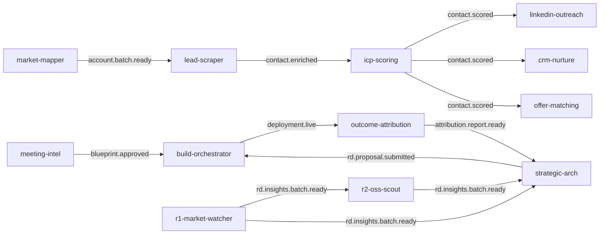

# OMERION AI Agent — Master Architecture & Fix Audit

_Generated: 2026-05-18 | Scope: 15 LangGraph employees + 26 factory agents + orchestration layer_

This document combines the first-pass agent audit with a second-pass deep dive: state propagation, DB column alignment, event bus wiring, HITL patterns, n8n bridge reality, deterministic gate gaps, skill-vs-code drift, and implementation stubs. Intended as the single handoff artifact for implementation.

---

## 0. Three-Catalog Overview

| Layer | Location | Count | Production execution |
|--------|----------|-------|-------------------|
| **Legacy LangGraph employees** | `omerion/agents/*` + `omerion/skills/*.skill.md` + `omerion/config/agents.yaml` | 15 registered | **YES** — Discord → `discord_route.py` → `run_executor` → LangGraph |
| **Department factory agents** | `departments/*` + `*.skill.md` (WAT CI) + `core/agents/agent_registry.py` | 26 + RSI workflow doc | **NO** — not in Discord `CHANNEL_SKILL_MAP`; invoked via API/factory only |
| **Dashboard personas** | `dashboard/src/data/agents.ts` | 27 (`USE_MOCK_DATA = true`) | **UI only** — not backend |

**Naming drift:** Dashboard splits two SCOUTs (`scout_af`, `scout_lg`); factory has `scout` (agentic_factory) + `sentinel` (lead_gen). Dashboard has `onboarding`; factory uses ARIA + Tally webhook. Factory has `ux_reviewer`; dashboard omits it.

**WAT definitions in repo:**

1. **CI Workflow Agent Template** — `scripts/check_wat.py` enforces `departments/<dept>/<agent>.py` + `<agent>.skill.md` with 9 H2 sections.
2. **Manual audit (legacy)** — `.claude/commands/audit-agent.md`: W5H + Architecture + Tools vs `omerion/agents/*`.

Legacy `omerion/skills/*.skill.md` are **not** CI-checked.

---

## 1. Orchestration Architecture

```
Triggers: Discord #channel | cron/APScheduler | POST /agents/{name}/run | Supabase events INSERT (Realtime broker)
    ↓
run_lifecycle.create_run(run_id) → execute_run(run_id)
    ↓
registry.run_agent_by_name(skill, inputs)  # session_id = run_id = thread_id
    ↓
LangGraph graph.invoke(inputs, config={thread_id: session_id})
    ↓
Nodes: tools.py (Supabase, HTTP, Pinecone) + ClaudeRouter (Tier.FAST|DEFAULT|HEAVY)
    ↓
emit_event() → events table → broker EVENT_SUBSCRIPTIONS → downstream agents (daemon threads)
```

**HITL pause path:** `interrupt()` in graph → `execute_run` returns `hitl_pending` → `founder_review_queue` row → founder resolves via `/hitl/resolve` → `execute_resume(run_id, payload)` → `resume_thread` → `graph.invoke(Command(resume=...))`.

**Factory path (parallel):** `BaseAgent` / `PromptAgent` → `core/runtime/event_bus.py` (CoreEventType) → optional `N8nBridge.invoke()` — **not** used by LangGraph employees.

### AgentRunState (base class)

```python
# omerion/omerion_core/state/base.py
run_id, agent_name, session_id, correlation_id
nodes_visited, errors
tokens_input, tokens_output, cost_usd, hitl_wait_ms
hitl_status, hitl_review_id, hitl_regen_attempts
scratch: dict[str, Any]  # per-graph ephemeral KV
```

---

## 2. Config Variables Reference

| Scope | Keys | Consumers |
|--------|------|-----------|
| `global` | `hitl_escalation_minutes`, `hitl_max_regeneration_retries`, `telemetry_flush_interval_seconds`, `default_rate_limit_backoff_seconds` | All HITL agents |
| `personas` (9) | `tier`, `priority`, `role_terms`, `problem_hypothesis`, `kpis` | market_mapper, lead_scraper, icp_scoring, offer_matching, linkedin_outreach, outcome_attribution |
| `offer_packages` | `demo_reference`, `problem`, `outcomes`, `best_fit_personas`, `price_band` | offer_matching, R1 tagging |
| `demo_catalog` | per-demo metadata | offer_matching |
| Per-agent blocks | feeds, caps, weights, schedules, thresholds | Each employee in `omerion/config/agents.yaml` |

---

## 3. Discord Routing Map

| Channel | Registry skill | DB `agents.id` (activity_logger) |
|---------|----------------|----------------------------------|
| `#nurture` | `crm-nurture` | `crm_nurture` |
| `#scout` | `lead-scraper` | `lead_scraper_enricher` |
| `#score` | `icp-scoring` | `icp_scoring` |
| `#reach` | `linkedin-outreach` | `linkedin_outreach` |
| `#leads` | `hq-lead-scraping` | `high_quality_lead_scraping` |
| `#match` | `offer-matching` | `offer_matching` |
| `#intel` | `meeting-intel` | `meeting_intelligence` |
| `#orch` | `build-orchestrator` | `build_orchestrator` |
| `#attrib` | `outcome-attribution` | `outcome_attribution` |
| `#watch` | `market-watcher` | `r1_market_tech_watcher` |
| `#oss` | `oss-scout` | `r2_oss_scout` |
| `#arch` | `strategic-arch` | `r3_strategic_architect` |
| `#eval` | `eval-telemetry` | `r4_evaluation_telemetry` |
| `#seek` | `job-seeker` | `job_seeker` |
| _(none)_ | `market-mapper` | `market_mapper` |

`#founder-hitl`, `#mission-control` → `None` (HITL / ops only).

---

## 4. Systemic Blockers (Affects All Agents)

| Issue | Impact | Fix |
|--------|--------|-----|
| **Migrations not applied to live Supabase** | `PGRST204`, missing tables — first DB touch fails | Run `omerion/infra/supabase/MASTER_MIGRATION.sql` once; `NOTIFY pgrst, 'reload schema';` |
| **Broker inputs ≠ graph state fields** | Event chain fires agents with empty `account_ids` / `candidate_contact_ids` | Map `inputs["event_payload"]` → state fields in `run_agent_by_name` or per-agent ingress node |
| **Schema drift (contacts/scores)** | icp_scoring, offer_matching, partial icp load | Align all SELECT/UPSERT to `0002`/`0003`/`0008` column names |
| **`a["id"]` vs `account_id`** | hq-lead-scraping, lead-scraper empty account maps | Replace with `account_id` (see §6.2–6.3) |
| **Checkpointer disabled** | HITL cannot resume after restart | Set `DATABASE_URL`; avoid `omerion_env=dev` for HITL testing |
| **Dual runtime R1–R4** | skill says `managed_agent`; code registers LangGraph | Pick one runtime per R agent |

---

## 5. Deterministic vs LLM Policy by Layer

| Layer | Must be deterministic (D) | LLM appropriate |
|--------|---------------------------|-----------------|
| Ingress / routing | Channel map, rate limits, idempotency keys | NL intent → JSON with schema validation |
| Data load | SQL columns, filters, caps | Never |
| Scoring / ranking | ICP math, segments, dedupe | Explanation text only |
| Compliance | opt-out, caps, stage gates, stop conditions | Never |
| HITL | `interrupt`, review queue IDs, resume | Never |
| Persistence | upsert keys, FK checks | Never |
| Creative | — | dossiers, drafts, proposals, digests |
| R&D pre-filter | RSS keyword filter, dedupe URL | Per-signal tagging |

---

## 6. Per-Agent Deep Audit (15 LangGraph)

### Global: `id` vs `account_id` index bugs

| File | Lines | Pattern |
|------|-------|---------|
| `high_quality_lead_scraping/graph.py` | 116, 126, 132, 156 | `a["id"]`, `findings_by_account[a["id"]]` — **load returns `account_id`** |
| `lead_scraper_enricher/graph.py` | 31 | `scratch["accounts"] = {a["id"]: a}` — **load returns `account_id`** |

No other graphs use `a["id"]` for accounts. Domain state fields (`findings_by_account`, `state.accounts`) use correct UUID keys once fixed.

### Global: Broker payload mapping gap

`omerion_core/events/broker.py` passes:

```python
inputs = {"event_type", "event_payload", "event_id"}
```

Downstream agents expect **`account_ids`**, **`candidate_contact_ids`**, etc. **No mapper exists** — event-triggered runs load empty cohorts unless fixed.

---

### 6.1 MAP — `market-mapper` (Agent #1)

**Graph:** `seed_markets` → `scrape` → `classify` → `rank` → `upsert` → `emit`  
**D/L/H:** D: scrape, rank, upsert, emit | L: classify (Haiku) | H: none  
**Checkpointer:** No (`g.compile()`)

#### State propagation

| Node | Reads scratch | Writes scratch | Domain state |
|------|---------------|----------------|--------------|
| seed_markets | — | — | `target_markets` |
| scrape | — | — | `candidates[]` |
| classify | — | — | mutates candidates |
| rank | — | — | scores on candidates |
| upsert | — | — | `account_id` on candidates |
| emit | — | — | — |

No `scratch` usage. No silent scratch bugs.

#### Tool ↔ DB alignment

| Table | Operation | Code columns | DB (migration) | Mismatch |
|-------|-----------|--------------|----------------|----------|
| markets | upsert | `name` | `name` | OK |
| accounts | upsert | `name,domain,website,linkedin_company_url,persona,market_id,market,volume_bucket,team_size_bucket,tech_maturity_signals,score,metadata,last_refreshed_at` | + `tier,status,confidence` defaults | OK (0008 adds `market`,`pain_signal`) |

#### Events

| Emits | Consumes | Broker downstream |
|-------|----------|-------------------|
| `ACCOUNT_BATCH_READY` per market (`payload.account_ids[]`) | cron only | `lead-scraper` |

**Broker gap:** `lead-scraper` expects `state.account_ids` but receives `event_payload` only → **orphaned trigger at runtime**.

#### HITL: N/A

#### n8n: None

#### Deterministic gaps

- No D validation on domain format before upsert.
- `classify` LLM could be gated by D keyword rules for persona.

#### Skill drift

- Skill may list RE personas; code/`agents.yaml` use 9 general personas.

#### Fixes (priority)

1. P0: Broker → map `event_payload.account_ids` → `account_ids` on enricher invoke.
2. P1: Align persona enum with `agents.yaml`.
3. P2: Add `#map` Discord channel or document cron-only.

---

### 6.2 SOURCE — `hq-lead-scraping` (Agent #2, `#leads`)

**Graph:** `parse_discord_intent` → `load_priority_accounts` → `research` → `synthesize` → `quality_gate` → `hitl_review` → `hitl_wait` → `persist_and_index` → `emit`  
**D/L/H:** D: load, research HTTP, quality_gate, persist | L: intent parse, dossier synth | **H: yes**

#### State propagation

| Node | Reads | Writes |
|------|-------|--------|
| parse_discord_intent | `state.inputs` (via discord_message), NOT scratch | `search_hint`, stub `accounts` |
| load_priority_accounts | — | `state.accounts` |
| research | `findings_by_account[a["id"]]` **BUG** | `findings_by_account` |
| synthesize | `findings_by_account.get(a["id"])` **BUG** | `dossiers[]` |
| quality_gate | `accounts_by_id = {a["id"]: a}` **BUG** | filters `dossiers` |
| hitl_* | dossiers, review_ids | decisions on dossiers |
| persist | approved dossiers | — |
| emit | — | — |

**Silent None:** research/synth keys never match loaded accounts → empty findings → empty dossiers.

#### Tool ↔ DB alignment

| Table | Operation | Code | DB | Mismatch |
|-------|-----------|------|-----|----------|
| accounts | select | `account_id,name,domain,...` | OK | — |
| research_dossiers | upsert | `account_id,contact_id,summary,track_record,current_niche,source_urls,pain_signals,...` | `summary,source_urls,pain_signals,...` — **no `track_record`,`current_niche`** | **MISSING_COLUMN** |
| research_dossiers | upsert on_conflict | `account_id` | **no UNIQUE(account_id)** in 0004 | **WRONG upsert key** |

#### Events

| Emits | Consumes |
|-------|----------|
| `DOSSIER_CREATED` (per approved dossier) | Discord message in `inputs` |

**Dead event:** `DOSSIER_CREATED` — **not in `EVENT_SUBSCRIPTIONS`**.

#### HITL

| Check | Status |
|-------|--------|
| `create_founder_review_task` before `interrupt` | Yes (`hitl_review`) |
| `interrupt()` | Yes (`hitl_wait`) |
| Checkpointer wired | Yes |
| Resume via `execute_resume` | Yes |
| `founder_review_queue` before interrupt | Yes |

#### n8n: None

#### Deterministic stubs needed

See §10 — `validate_dossier_quality`, `parse_discord_intent_deterministic`.

#### Fixes

1. P0: Replace all `a["id"]` with `a["account_id"]`.
2. P0: Apply migrations + fix dossier columns / upsert conflict.
3. P1: Wire `DOSSIER_CREATED` consumer or remove emit.

---

### 6.3 FIND — `lead-scraper` (Agent #3, `#scout`)

**Graph:** `load_accounts` → `scrape` → `classify` → `upsert` → `emit`  
**D/L/H:** D: scrape, upsert | L: classify | H: no (checkpointer attached anyway)

#### State propagation

| Node | Reads scratch | Writes scratch |
|------|---------------|----------------|
| load_accounts | — | `accounts` keyed by **`a["id"]` BUG** |
| scrape | `scratch["accounts"]` | `raw_leads` |
| classify | `accounts.get(str(lead.account_id))` | `enriched` — **lookup misses** if key wrong |
| upsert | — | — |
| emit | — | — |

#### Tool ↔ DB alignment

| Table | Operation | Code | DB | Mismatch |
|-------|-----------|------|-----|----------|
| accounts | select | `account_id,name,domain,market_id,tier,status` | OK | — |
| contacts | upsert | `first_name,last_name,role,locale,source,source_url,status` | OK (0008 adds locale/source) | — |

#### Events

| Emits | Consumes (broker) |
|-------|-------------------|
| `CONTACT_ENRICHED` `{contact_id, account_id, persona}` | `ACCOUNT_BATCH_READY` → **broken payload map** |

#### HITL: N/A (checkpointer unnecessary)

#### Fixes

1. P0: `scratch["accounts"] = {a["account_id"]: a for a in accounts}`.
2. P0: Broker maps `account_ids` from batch event.
3. P2: D dedup/opt-out before upsert.

---

### 6.4 RATE — `icp-scoring` (Agent #6, `#score`)

**Graph:** `load` → `score` → `persist` → `shortlist` → `digest` → `emit`  
**D/L/H:** D: score, persist, shortlist | L: explain_intent, digest | H: no

#### State propagation

| Node | Reads | Writes |
|------|-------|--------|
| load | `candidate_contact_ids` | `contacts` |
| score | `contacts` | `scored` |
| persist | `scored` | — |
| shortlist | `scored` | `shortlist` |
| digest | `shortlist` | `scratch["digest_md"]` |
| emit | `scored`, `shortlist` | — |

**Broker gap:** `CONTACT_ENRICHED` payload has `contact_id` but state expects `candidate_contact_ids: list[UUID]` — **not mapped**.

#### Tool ↔ DB alignment

| Table | Operation | Code columns | DB columns | Mismatch |
|-------|-----------|--------------|------------|----------|
| contacts | select | `id, full_name, title, locale, stage, accounts.industry, employee_count` | `contact_id, first_name, last_name, role, accounts.team_size_bucket, market, pain_signal` | **WRONG_NAME** ×6 |
| contacts | filter `.in_("id", ...)` | `id` | `contact_id` | **WRONG_NAME** |
| scores | upsert | `fit, intent, timing, final, explanations` | `fit_score, intent_score, timing_score, final_score, rationale, weights_snapshot` | **WRONG_NAME** ×4; **MISSING** `weights_snapshot` |
| contact_activity_log | select count | `.select("id")` | `activity_id` | **WRONG_NAME** |

#### Events

| Emits | Broker consumers |
|-------|------------------|
| `CONTACT_SCORED` (per contact) | linkedin-outreach, crm-nurture, offer-matching |
| `FOUNDER_DAILY_DIGEST` | **none (dead)** |

**Broker gap:** downstream need `candidate_contact_ids` from `payload.contact_id`.

#### HITL: N/A (checkpointer present but unused)

#### Fixes

1. P0: Rewrite `load_candidates` / `write_scores` to migration column names.
2. P0: Broker maps `contact_id` → `candidate_contact_ids`.
3. P1: Update skill Output Contract.
4. P2: Subscriber for digest or remove dead emit.

---

### 6.5 REACH — `linkedin-outreach` (Agent #4, `#reach`)

**Graph:** `load_cohort` → `plan_steps` → `apply_caps` → `rag_augment` → `draft` → `hitl_review` → `hitl_wait` → `send_or_discard` → `emit` → `write_signals`  
**D/L/H:** D: plan, caps, queue | L: draft | **H: yes**

#### State propagation

| Node | Reads scratch | Writes |
|------|---------------|--------|
| hitl_wait | — | `decision_notes` |
| Others | — | domain: `cohort`, `planned`, `drafts` |

Uses `candidate_contact_ids` — **broker gap** on `CONTACT_SCORED`.

#### Tool ↔ DB alignment

| Table | Code | DB | Mismatch |
|-------|------|-----|----------|
| contacts | `contact_id, first_name, last_name, role, ...` | OK (0008 stop fields) | — |
| contact_activity_log | `.select("id")` | `activity_id` | **WRONG_NAME** |
| outbound_communications | upsert idempotency | OK | — |

#### Events

| Emits | Consumers |
|-------|-----------|
| `OUTREACH_LI_SENT` | **dead** (reply via `outreach/tracker.py`) |

#### HITL: `interrupt()` + checkpointer + review before interrupt — **OK**

#### Fixes

1. P0: Broker payload map for `contact_id`.
2. P1: Fix activity_log select column.
3. P2: D hard-stop in `apply_caps` before draft.

---

### 6.6 GROW — `crm-nurture` (Agent #5, `#nurture`)

**Graph:** `load_candidates` → `filter_due` → `rag_augment` → `draft` → `hitl_review` → `hitl_wait` → `send_or_discard` → `emit` → `write_signals`  
**D/L/H:** D: filter, send, locks | L: email/SMS draft | **H: yes**

#### State propagation

Same pattern as REACH; `scratch["decision_notes"]` on HITL wait.

#### Tool ↔ DB alignment

Contacts select: **aligned** with 0008.  
`contact_activity_log.select("id")` → **WRONG_NAME** (`activity_id`).

#### Events

| Emits | Consumers |
|-------|-----------|
| `OUTREACH_EMAIL_SENT` / `OUTREACH_SMS_SENT` | **dead** |

#### HITL: **OK** (`interrupt` + checkpointer)

#### n8n

Factory `departments/lead_gen/nurture.skill.md` references n8n cadence; **LangGraph agent does not call n8n**.

#### Fixes

1. P0: Broker `contact_id` map; migration 0008 for `stage`.
2. P1: activity_log column fix.
3. P2: D stage transition rules.

---

### 6.7 PAIR — `offer-matching` (Agent #7, `#match`)

**Graph:** `load_hot_contacts` → `propose` → `hitl_review` → `hitl_wait` → `persist` → `emit`  
**D/L/H:** D: load | L: propose (Opus) | **H: yes**

#### Tool ↔ DB alignment

| Table | Code | DB | Mismatch |
|-------|------|-----|----------|
| scores | `fit,intent,timing,final` | `fit_score,...` | **WRONG_NAME** |
| scores join | `contacts(id, full_name, title,...)` | `contact_id, first_name, last_name, role` | **WRONG_NAME** |
| opportunities | `service_package, demo_reference, price_band` | `offer_modules, offer_tier, pricing_band` | **WRONG_NAME** |
| propose_offer | `UUID(contact["id"])` | `contact_id` | **WRONG_NAME** |

#### Events

| Emits | Consumers |
|-------|-----------|
| `PROPOSAL_READY` | **dead** |

#### HITL: **OK**

#### Fixes

1. P0: scores + contacts query rewrite.
2. P0: Map opportunity columns or extend migration.
3. P1: D pre-filter hot segment before LLM.
4. P1: Broker `contact_id` map.

---

### 6.8 CAPTURE — `meeting-intel` (Agent #8, `#intel`)

**Graph:** `fetch` → `extract_w5h` → `extract_ttwa` → `classify_persona` → `synthesize_proposal` → `build_backlog` → `raise_flags` → `persist` → `create_review` → `hitl_wait` → (`emit_approved`|`emit_rejected`)  
**D/L/H:** D: fetch, embed | L: all extraction nodes | **H: yes** (conditional regen)

#### State propagation

| Node | scratch |
|------|---------|
| hitl_wait / regen | `decision_notes`, `founder_feedback` |
| emit paths | — |

#### Tool ↔ DB alignment

| blueprints insert | Code | DB 0003 + 0008 | Mismatch |
|-------------------|------|----------------|----------|
| | `proposal`, `persona`, `persona_tier`, `w5h`, `ttwa` | `architecture_md`, `w5h`, `backlog` | **MISSING** `proposal`; **partial** 0008 adds `ttwa`, `contact_id` |

#### Events

| Emits | Consumers |
|-------|-----------|
| `BLUEPRINT_DRAFT_CREATED` | **dead** |
| `BLUEPRINT_APPROVED` | `build-orchestrator` |
| `BLUEPRINT_REJECTED` | **dead** |

Trigger: **Fireflies HTTP** (`MEETING_TRANSCRIPT_RECEIVED`) — not broker.

#### HITL: **OK** — review created in `create_review` before `interrupt`

#### Fixes

1. P0: Align blueprint insert to schema.
2. P1: D W5H required-field validation before HITL.
3. P2: Register or remove dead emits.

---

### 6.9 RUN — `build-orchestrator` (Agent #9, `#orch`)

**Graph:** `load_blueprint` → `decompose` → `create_deployment_row` → `persist_tasks` → `execute_tasks` → `hitl_deploy_review` → `hitl_deploy_wait` → `finalize_deployment` → `deliver_client_docs` → `emit_deployment`  
**D/L/H:** D: GitHub, deployment rows | L: decompose, docs | **H: deploy**

#### State propagation

| Node | Reads scratch | Writes |
|------|---------------|--------|
| load_blueprint | — | `blueprint`, `blueprint_summary` |
| decompose | `blueprint` | `tasks` |
| hitl_deploy_wait | — | `decision_notes` |
| deliver_client_docs | `blueprint` | `deliverables` |

#### Events

| Emits | Consumers |
|-------|-----------|
| `BUILD_TASK_CREATED` (after decompose) | **dead** |
| `DEPLOYMENT_LIVE` / `DEPLOYMENT_FAILED` | `outcome-attribution` on LIVE only |

#### HITL: **OK** (`interrupt` on deploy)

#### Fixes

1. P1: D task status machine.
2. P2: Document `BUILD_TASK_CREATED` or wire consumer.

---

### 6.10 PROVE — `outcome-attribution` (Agent #10, `#attrib`)

**Graph:** `load_deployment` → `compute_deltas` → `summarize` → `feedback` → `persist_report` → `persist_feedback` → `emit`  
**D/L/H:** D: deltas | L: summary, feedback | H: no

#### State propagation: no scratch (domain: `deployment_id`, deltas, `summary_md`)

#### Events

| Emits | Consumers |
|-------|-----------|
| `ATTRIBUTION_REPORT_READY` | `strategic-arch` |
| `RD_INSIGHTS_BATCH_READY` (secondary) | oss-scout, strategic-arch |

#### n8n: None

#### Fixes: P2 D threshold before LLM summary.

---

### 6.11 TRACK — `market-watcher` (R1, `#watch`)

**Graph:** `fetch` → `filter` → `tag` → `persist` → `index` → `emit`  
**D/L/H:** D: fetch, filter, dedupe | L: tag (Haiku) | H: no

#### Skill drift

- Frontmatter: `runtime: managed_agent`
- `__init__.py`: `register(..., runtime="langgraph")`

#### Tool ↔ DB: `rd_insights` insert columns **match** 0005 if migration applied.

#### Events: `RD_INSIGHTS_BATCH_READY` → oss-scout + strategic-arch

#### Fixes: P0 migration 0005; P1 resolve managed vs local runtime; P2 D dedupe before LLM.

---

### 6.12 SEEK/OSS — `oss-scout` (R2, `#oss`)

**Graph:** `discover` → `filter` → `analyze` → `persist` → `emit`  
**D/L/H:** D: discover, star filter | L: analyze | H: no

#### Events: `RD_INSIGHTS_BATCH_READY` — **note:** R2 emits same event type as R1 (batch ready for R3) — broker re-triggers R2 on R1 emit (may be intentional re-scout).

#### Tool ↔ DB: `oss_candidates` — OK if migration applied.

#### Fixes: P2 D license/star gate before LLM.

---

### 6.13 SHAPE — `strategic-arch` (R3, `#arch`)

**Graph:** `load_signals` → `synthesize` → `persist` → `hitl_review` → `hitl_wait` → `emit`  
**D/L/H:** L: synthesize | **H: yes — WRONG PATTERN**

#### HITL audit

| Check | Status |
|-------|--------|
| `interrupt()` | **NO** |
| `wait_for_decision()` inside `hitl_wait` node | **YES — blocks worker thread** |
| Checkpointer on compile | **NO** (`g.compile()` without checkpointer) |
| Resume via `execute_resume` | **NO** — polling only |

#### Events: `RD_PROPOSAL_SUBMITTED` → build-orchestrator

#### Fixes

1. **P1:** Migrate to `interrupt()` + checkpointer (match other HITL agents).
2. P2: D signal bundle caps before LLM.

---

### 6.14 GUARD — `eval-telemetry` (R4, `#eval`)

**Graph:** `load` → `persist` → `detect` → `alert` → `emit`  
**D/L/H:** **fully D** | H: no

#### Events

| Emits | Consumers |
|-------|-----------|
| `REGRESSION_ALERT` | **dead** |
| `RD_INSIGHTS_BATCH_READY` | oss-scout, strategic-arch — **questionable** (telemetry ≠ market insights) |

#### Fixes: P3 wire alert to Discord; fix misleading `RD_INSIGHTS_BATCH_READY` emit or rename event.

---

### 6.15 SEEK/Jobs — `job-seeker` (Agent #14, `#seek`)

**Graph:** `discover_postings` → `filter_relevant` → `load_profile` → `rank_opportunities` → `draft_applications` → `flag_risks` → `hitl_review` → `hitl_wait` → `submit_applications` → `track_status` → `emit`  
**D/L/H:** D: discover, flags | L: rank, draft | **H: yes**

#### State propagation

| Node | scratch |
|------|---------|
| hitl_wait | `decision_notes` |
| track_status | `ghost_application_ids` (read in later node) |

#### Events (all **dead** for broker)

`JOB_POSTING_DISCOVERED`, `APPLICATION_SENT`, `APPLICATION_GHOSTED`

#### HITL: **OK** (`interrupt` + checkpointer)

#### Fixes: P2 make `flag_risks` fully D; P3 document job events or add consumers.

---

## 7. Department Factory Agents (26)

**WAT CI:** `scripts/check_wat.py` — all `departments/*/<agent>.py` + `<agent>.skill.md` required.

| Department | Agents | Runtime | Architecture gap |
|------------|--------|---------|-------------------|
| agentic_factory | aria, forge, scout, gatekeeper, patcher | `PromptAgent` / `BaseAgent` | Single `_execute()` — **no LangGraph nodes**; FORGE calls `n8n_bridge` |
| lead_gen | mapper, enrich, icp_scorer, outreach, nurture, sentinel | mixed | Documented events in YAML **not wired to legacy broker** |
| research_intelligence | librarian, strategist, analyst, competitor | mostly LLM | No Supabase pipeline parity with R1–R3 |
| client_delivery | scribe, proposer, attribution, success_ops | mixed | Parallel to meeting-intel / offer-matching / attribution — **duplicate concepts** |
| recursive_self_improvement | observer, ux_reviewer, prompt_optimizer, rag_auditor, token_optimizer, seeker, synthesis | mixed | RSI triggered by n8n cron → `/api/v1/webhooks/rsi/trigger`, not LangGraph |

**MAPPER example** (`departments/lead_gen/mapper.py`): one `PromptAgent.build_user_prompt()` → Claude → `extract_result()` JSON. **No deterministic steps** despite WAT "Reasoning Chain" section in skill.

**Factory vs production:** Discord and `EVENT_SUBSCRIPTIONS` only know **kebab-case LangGraph skills**. Factory agents are reachable via FastAPI agent registry (if mounted) but not `#channels`.

---

## 8. Cross-Agent Event Bus Map

### Broker map (`omerion_core/events/broker.py`)

```
market-mapper          ──account.batch.ready──► lead-scraper
lead-scraper           ──contact.enriched────► icp-scoring
icp-scoring            ──contact.scored──────► linkedin-outreach | crm-nurture | offer-matching
meeting-intel          ──blueprint.approved───► build-orchestrator
strategic-arch         ──rd.proposal.submitted► build-orchestrator
build-orchestrator     ──deployment.live─────► outcome-attribution
outcome-attribution    ──attribution.report.ready► strategic-arch
r1 / r2 / r4           ──rd.insights.batch.ready► oss-scout | strategic-arch
```

### Mermaid



### Dead events (emitted, no broker consumer)

`DOSSIER_CREATED`, `FOUNDER_DAILY_DIGEST`, `BLUEPRINT_DRAFT_CREATED`, `BLUEPRINT_REJECTED`, `PROPOSAL_READY`, `BUILD_TASK_CREATED`, `DEPLOYMENT_FAILED`, `REGRESSION_ALERT`, `OUTREACH_LI_SENT`, `OUTREACH_EMAIL_SENT`, `OUTREACH_SMS_SENT`, `JOB_POSTING_DISCOVERED`, `APPLICATION_SENT`, `APPLICATION_GHOSTED`, `ACCOUNT_DISCOVERED`, `ACCOUNT_UPDATED`, `CONTACT_COHORT_READY`, all `OUTREACH_*` signal events, `HITL_*`, `APPLICATION_*` (except none wired).

### Orphaned triggers (expected consume, nothing emits)

- `contact.engagement` — **not in EventType enum**
- `opportunity.created` — **not in EventType enum**
- Broker comment: `MEETING_TRANSCRIPT_RECEIVED` — HTTP Fireflies only (OK if documented)

### Broken at runtime (emit + consumer exist, payload not mapped)

| Upstream | Event | Downstream | Missing mapping |
|----------|-------|------------|-----------------|
| market-mapper | `account.batch.ready` | lead-scraper | `event_payload.account_ids` → `account_ids` |
| lead-scraper | `contact.enriched` | icp-scoring | `contact_id` → `candidate_contact_ids` |
| icp-scoring | `contact.scored` | reach/nurture/match | same |

---

## 9. Priority Fix Roadmap

### P0 — Unblocks everything

1. Run `MASTER_MIGRATION.sql` on Supabase.
2. Fix `a["id"]` → `account_id` in hq-lead-scraping + lead-scraper graphs.
3. Fix icp_scoring + offer_matching Supabase column names (contacts, scores, opportunities).
4. Add `run_agent_by_name` event ingress mapper (see §10 `map_event_payload_to_state`).

### P1 — Correctness

5. R3 HITL: `wait_for_decision` → `interrupt()` + checkpointer.
6. research_dossiers upsert columns + conflict key.
7. meeting_intelligence blueprints insert alignment.
8. contact_activity_log: `id` → `activity_id` in REACH/GROW.
9. Enable checkpointer (`DATABASE_URL`, non-dev env) for HITL QA.

### P2 — Determinism

10. Per-agent D gates (quality_gate, caps, segment filters) — §10 stubs.
11. R1/R2 D pre-filters before LLM.

### P3 — Documentation / wiring

12. Sync all `omerion/skills/*.skill.md` Output Contracts to migrations.
13. Resolve R1–R4 `managed_agent` vs LangGraph registration.
14. Discord `#map` or cron doc for market-mapper.
15. Dead events: wire consumers or stop emitting.

### P4 — Factory + n8n

16. Decide single owner for nurture cadence (n8n vs LangGraph).
17. Factory agent HTTP routes + event bus integration.
18. n8n recipe ↔ emit matrix (§8.1).

---

## 8.1 n8n Bridge Reality Check

### LangGraph agents calling `n8n_bridge` directly

**None.** All 15 LangGraph employees use Supabase `emit_event` only.

### Factory / API callers

| Caller | Recipe / path |
|--------|----------------|
| `departments/agentic_factory/forge.py` | `n8n` provision (via `get_bridge().invoke`) |
| `api/webhooks/router.py` | Inbound `POST /api/v1/n8n/callback/{recipe}` |

### Recipes (`n8n/recipes/*.json`)

| Recipe | Trigger mechanism | Intended LangGraph agent | Gap |
|--------|-------------------|--------------------------|-----|
| `rsi_weekly_trigger.json` | Schedule → `POST /api/v1/webhooks/rsi/trigger` | RSI factory workflow (not LangGraph) | OK — factory |
| `tally_onboarding_intake.json` | Tally webhook → `POST .../onboarding/tally` | ARIA (factory) | No LangGraph emit |
| `lead_sheet_sync.json` | Schedule 10m → Google Sheets → HTTP | Ingestion API (not broker) | No `emit_event` from sheet sync |
| `crm_write.json` | Webhook `crm_write` (factory HMAC) | Factory CRM write | Outbound from FORGE, not agent emit |
| `approval_discord_relay.json` | Webhook | Approvals API / HITL | Triggered by `api/approvals` not LangGraph |

### HMAC validation (`api/webhooks/router.py`)

| Condition | Behavior |
|-----------|----------|
| `bridge.configured` + valid signature | Accept |
| `bridge.configured` + bad signature | **401** |
| `not bridge.configured` + `runtime_env == prod` | **503** (fail closed) |
| `not bridge.configured` + dev | **Warning, accepts unsigned** |

### Missing LangGraph emits for recipes

Recipes are **factory/API-scheduled**, not event-bus-driven from LangGraph. No recipe is blocked solely by a missing `emit_event` — except if you expect `lead_sheet_sync` to trigger `lead-scraper` (it does not today).

---

## 10. Deterministic Function Stubs

Implement under `omerion/omerion_core/deterministic/` or per-agent `tools.py` as noted.

### Global — event ingress

```python
# omerion/omerion_core/runtime/event_ingress.py
# TODO: Call from run_agent_by_name() when inputs contain event_payload.

def map_event_payload_to_state(agent_name: str, inputs: dict) -> dict:
    """Map broker event_payload into LangGraph state field names."""
    payload = inputs.get("event_payload") or {}
    out = dict(inputs)
    if agent_name == "lead-scraper":
        ids = payload.get("account_ids") or []
        out["account_ids"] = [UUID(x) if isinstance(x, str) else x for x in ids]
    elif agent_name in ("icp-scoring", "linkedin-outreach", "crm-nurture", "offer-matching"):
        cid = payload.get("contact_id")
        if cid:
            out["candidate_contact_ids"] = [UUID(cid) if isinstance(cid, str) else cid]
    return out
```

### SOURCE — hq-lead-scraping

```python
# omerion/agents/high_quality_lead_scraping/deterministic.py
# Node: quality_gate (replaces partial LLM reliance)

def validate_dossier_quality(dossier: "Dossier", *, min_sources: int, min_pain: int) -> tuple[bool, str]:
    """D gate before HITL. Returns (pass, reason_code)."""
    # TODO: enforce disqualification_flags, len(source_urls), len(pain_signals)
    raise NotImplementedError
```

### FIND — lead-scraper

```python
def build_account_index(accounts: list[dict]) -> dict[str, dict]:
    """Node: load_accounts. Key by account_id, never 'id'."""
    return {str(a["account_id"]): a for a in accounts}

def should_skip_contact_upsert(row: dict) -> bool:
    """Node: upsert. D opt-out / missing email+linkedin."""
    # TODO: check do_not_contact, email OR linkedin present
    raise NotImplementedError
```

### RATE — icp-scoring

```python
def normalize_contact_row(row: dict) -> dict:
    """Node: load. Map DB contact_id, first_name+last_name, role, team_size_bucket."""
    # TODO: replace legacy id/full_name/title/employee_count
    raise NotImplementedError

def score_row_to_db(row: "ScoredContact", run_date: date) -> dict:
    """Node: persist. Emit fit_score, intent_score, timing_score, final_score, weights_snapshot."""
    raise NotImplementedError
```

### REACH / GROW

```python
def enforce_outreach_cap(contact_id: UUID, channel: str, cfg: dict) -> bool:
    """Node: apply_caps. Return False to skip before draft LLM."""
    # TODO: query outbound_communications counts vs cfg daily/weekly caps
    raise NotImplementedError
```

### PAIR — offer-matching

```python
def filter_hot_scores(rows: list[dict], *, min_final: float = 0.75) -> list[dict]:
    """Node: load_hot_contacts. D filter before propose LLM."""
  # TODO: use fit_score/final_score from DB
    raise NotImplementedError
```

### CAPTURE — meeting-intel

```python
def validate_w5h_complete(w5h: dict) -> list[str]:
    """Node: after extract_w5h. Return list of missing required keys; block persist if non-empty."""
    raise NotImplementedError
```

### TRACK — r1

```python
def prefilter_signal(signal: dict, keywords: list[str]) -> bool:
    """Node: filter. D keyword match before tag LLM."""
    raise NotImplementedError
```

### SHAPE — r3

```python
def cap_signal_bundle(bundle: dict, *, max_insights: int = 50) -> dict:
    """Node: load_signals. D truncate/sort before synthesize LLM."""
    raise NotImplementedError
```

### SEEK — job-seeker

```python
def evaluate_application_risks(posting: dict, profile: dict) -> list[str]:
    """Node: flag_risks. Fully D: ghost, deadline, visa keywords."""
    raise NotImplementedError
```

---

## Appendix A — HITL Pattern Matrix

| Agent | HITL | create_review before interrupt | interrupt() | checkpointer on compile | wait_for_decision | resume_thread |
|-------|------|-------------------------------|-------------|-------------------------|-------------------|---------------|
| hq-lead-scraping | Y | Y | Y | Y | N | Y |
| lead-scraper | N | — | — | Y* | N | — |
| icp-scoring | N | — | — | Y* | N | — |
| linkedin-outreach | Y | Y | Y | Y | N | Y |
| crm-nurture | Y | Y | Y | Y | N | Y |
| offer-matching | Y | Y | Y | Y | N | Y |
| meeting-intel | Y | Y | Y | Y | N | Y |
| build-orchestrator | Y | Y | Y | Y | N | Y |
| job-seeker | Y | Y | Y | Y | N | Y |
| strategic-arch | Y | Y | **N** | **N** | **Y** | **N** |
| Others | N | — | — | N | N | — |

\*checkpointer compiled but HITL not used — harmless overhead.

**Checkpointer disabled when:** `DATABASE_URL` empty OR `omerion_env == dev` (`omerion_core/runtime/checkpointer.py`).

---

## Appendix B — Skill Doc vs Code Drift (summary)

| Agent | runtime frontmatter | Registered | Output contract drift | Trigger drift |
|-------|---------------------|------------|----------------------|---------------|
| r1-market-tech-watcher | managed_agent | langgraph | OK if migrated | managed_agent_cron vs local graph |
| icp-scoring | langgraph | langgraph | **fit vs fit_score** | contact.enriched OK; broker broken |
| hq-lead-scraping | langgraph | langgraph | dossier columns | Discord OK |
| offer-matching | langgraph | langgraph | scores + opportunities columns | contact.scored |
| proposal-drafting.skill.md | — | **not registered** | duplicates meeting-intel | — |
| lead-scoring.skill.md | — | **not registered** | duplicates icp-scoring | — |

---

## Appendix C — First-Pass Agent Summary (Graph / D-L-H / Fixes)

| Codename | Skill | Graph (short) | D/L/H | Top fixes |
|----------|-------|---------------|-------|-----------|
| MAP | market-mapper | seed→scrape→classify→rank→upsert→emit | D+L | Broker payload map; persona align |
| SOURCE | hq-lead-scraping | parse→load→research→synth→gate→HITL→persist | D+L+H | **account_id keys**; dossier schema |
| FIND | lead-scraper | load→scrape→classify→upsert→emit | D+L | **account index**; broker map |
| RATE | icp-scoring | load→score→persist→shortlist→digest→emit | D+L | **column renames**; broker map |
| REACH | linkedin-outreach | load→plan→caps→rag→draft→HITL→send | D+L+H | broker map; activity_id |
| GROW | crm-nurture | load→filter→rag→draft→HITL→send | D+L+H | migration 0008; broker map |
| PAIR | offer-matching | load→propose→HITL→persist | D+L+H | scores/opportunities schema |
| CAPTURE | meeting-intel | fetch→…→HITL→emit | D+L+H | blueprints schema |
| RUN | build-orchestrator | load→decompose→…→HITL deploy | D+L+H | task state machine |
| PROVE | outcome-attribution | load→deltas→summary→persist | D+L | delta thresholds |
| TRACK | market-watcher | fetch→filter→tag→persist | D+L | migration 0005; runtime pick |
| SEEK/OSS | oss-scout | discover→filter→analyze→persist | D+L | D star filter |
| SHAPE | strategic-arch | load→synth→persist→HITL | L+H | **interrupt migration** |
| GUARD | eval-telemetry | load→persist→detect→alert | D | alert wiring |
| SEEK/jobs | job-seeker | discover→…→HITL→submit | D+L+H | D risk flags |

---

## Appendix D — Per-Node State Propagation (Complete)

Legend: **R** = read, **W** = write. Fields on `AgentRunState` base (`run_id`, `session_id`, `correlation_id`, `nodes_visited`, `errors`, `cost_*`, `hitl_*`) omitted unless touched.

### MAP — market-mapper

| Node | scratch R/W | Domain state R/W |
|------|-------------|------------------|
| seed_markets | — | W: `target_markets` |
| scrape | — | R/W: `candidates[]` |
| classify | — | R/W: each candidate scores/persona |
| rank | — | R/W: `candidates` ordering |
| upsert | — | W: `account_id` on candidates |
| emit | — | R: `candidates` (qualified) |

### SOURCE — hq-lead-scraping

| Node | scratch | Domain |
|------|---------|--------|
| parse_discord_intent | — | R: `inputs.discord_message`; W: `discord_message`, `search_hint`, `accounts[]` stubs |
| load_priority_accounts | — | W: `accounts` |
| research | — | R: `accounts`; W: `findings_by_account` **(broken keys `a["id"]`)** |
| synthesize | — | R: `accounts`, `findings_by_account`; W: `dossiers` |
| quality_gate | — | R/W: `dossiers`, counters `skipped_*` |
| hitl_review | — | W: `review_id` on each dossier |
| hitl_wait | — | R: review_ids; W: `decision` per dossier |
| persist_and_index | — | R: approved dossiers; W: `dossiers_written` |
| emit | — | R: approved dossiers |

### FIND — lead-scraper

| Node | scratch | Domain |
|------|---------|--------|
| load_accounts | W: `accounts` **keyed by wrong `id`** | R: `account_ids` |
| scrape | R: `accounts` | W: `raw_leads` |
| classify | R: `accounts` | W: `enriched` |
| upsert | — | W: `contact_id` on enriched, `upserted` |
| emit | — | R: `enriched` |

### RATE — icp-scoring

| Node | scratch | Domain |
|------|---------|--------|
| load | — | R: `candidate_contact_ids`; W: `contacts` |
| score | — | R: `contacts`; W: `scored` |
| persist | — | R: `scored` |
| shortlist | — | R: `scored`; W: `shortlist` |
| digest | — | R: `shortlist`; W: `scratch.digest_md`, `digest_sent` |
| emit | R: `digest_md` (implicit via state) | R: `scored`, `shortlist` |

### REACH — linkedin-outreach

| Node | scratch | Domain |
|------|---------|--------|
| load_cohort | — | R: `candidate_contact_ids`; W: `cohort` |
| plan_steps | — | R: `cohort`; W: `planned` |
| apply_caps | — | R/W: `planned`, `skipped_capped` |
| rag_augment | — | R: `planned` (mutates context) |
| draft | — | W: `drafts` |
| hitl_review | — | W: `review_id`, `hitl_review_id` |
| hitl_wait | W: `decision_notes` | W: `decision` |
| send_or_discard | — | R: `decision`, `drafts`; W: `sent_count` |
| emit | — | R: `decision`, `drafts` |
| write_signals | — | R: `planned`, `drafts`, `decision` |

### GROW — crm-nurture

| Node | scratch | Domain |
|------|---------|--------|
| load_candidates | — | R: `candidate_contact_ids`; W: `candidates` |
| filter_due | — | R/W: `candidates`, `skipped_cooldown` |
| rag_augment | — | R: `candidates` |
| draft | — | W: `drafts`, `skipped_stop_condition` |
| hitl_review | — | W: `review_id` |
| hitl_wait | W: `decision_notes` | W: `decision` |
| send_or_discard | — | R: `decision`, `drafts`, `candidates` |
| emit | — | R: `decision`, `drafts` |
| write_signals | — | R: `decision`, `drafts`, `candidates` |

### PAIR — offer-matching

| Node | scratch | Domain |
|------|---------|--------|
| load_hot_contacts | — | R: `candidate_contact_ids`; W: `hot_contacts` |
| propose | — | R: `hot_contacts`; W: `proposals` |
| hitl_review | — | W: `review_id` per proposal |
| hitl_wait | W: `decision_notes` | W: `decision` on proposals |
| persist | W: `opportunity_ids` (append) | R: approved proposals |
| emit | R: `opportunity_ids` | R: proposals |

### CAPTURE — meeting-intel

| Node | scratch | Domain |
|------|---------|--------|
| fetch | — | W: transcript fields |
| extract_w5h / ttwa / classify / synthesize / backlog / flags | — | W: `blueprint` draft fields |
| persist | — | W: `blueprint_id` |
| create_review | — | W: `review_id`; emits `BLUEPRINT_DRAFT_CREATED` |
| hitl_wait | W: `decision_notes` | W: `decision`; regen uses `hitl_regen_attempts` |
| emit_approved / rejected | W: `decision_notes` | R: `blueprint` |

### RUN — build-orchestrator

| Node | scratch | Domain |
|------|---------|--------|
| load_blueprint | W: `blueprint`, `blueprint_summary` | R: `blueprint_id` |
| decompose | R: `blueprint` | W: `tasks` |
| create_deployment_row | — | W: `deployment_id`, status fields |
| persist_tasks | — | W: task rows |
| execute_tasks | R: `blueprint_summary` | W: task execution status |
| hitl_deploy_review | — | W: `deployment_hitl_review_id` |
| hitl_deploy_wait | W: `decision_notes` | W: deploy decision |
| finalize_deployment | R: `blueprint` | W: `deployment_status` |
| deliver_client_docs | R: `blueprint` | W: `deliverables` |
| emit_deployment | — | R: deployment status |

### PROVE — outcome-attribution

| Node | scratch | Domain |
|------|---------|--------|
| load_deployment | — | R: `deployment_id`; W: `go_live_at`, `client_id`, `persona`, `window_days` |
| compute_deltas | — | W: `kpi_deltas`, revenue/conversion fields |
| summarize | — | W: `summary_md` |
| feedback | — | W: `feedback[]` |
| persist_report | — | W: `report_id` |
| persist_feedback | — | — |
| emit | — | R: report + proof points |

### TRACK — r1-market-watcher

| Node | scratch | Domain |
|------|---------|--------|
| fetch | — | W: `raw[]` |
| filter | — | R/W: `raw` → filtered |
| tag | — | W: `insights[]` |
| persist | — | W: `inserted`, `duplicates` |
| index | — | R: `insights` |
| emit | — | R: `insights` |

### SEEK/OSS — r2-oss-scout

| Node | scratch | Domain |
|------|---------|--------|
| discover | — | W: `raw[]` |
| filter | — | R/W: `raw` |
| analyze | — | W: `scored[]` |
| persist | — | — |
| emit | — | R: `scored` |

### SHAPE — r3-strategic-architect

| Node | scratch | Domain |
|------|---------|--------|
| load_signals | — | W: `bundle` |
| synthesize | — | W: `proposals[]` |
| persist | — | W: proposal rows + `review_id` |
| hitl_review | — | W: review tasks |
| hitl_wait | — | **polls** `wait_for_decision`; W: `decision` on proposals |
| emit | — | R: approved proposals |

### GUARD — r4-eval-telemetry

| Node | scratch | Domain |
|------|---------|--------|
| load | — | W: `current`, `baseline` metrics |
| persist | — | — |
| detect | — | W: `alerts[]` |
| alert | — | — |
| emit | — | R: `alerts` |

### SEEK/jobs — job-seeker

| Node | scratch | Domain |
|------|---------|--------|
| discover_postings | — | W: `raw_postings`, `skipped_duplicate` |
| filter_relevant | — | R: `resume_text` (may be empty); W: `relevant_postings` |
| load_profile | — | W: `resume_text`, `cover_letter_template` |
| rank_opportunities | — | R: `relevant_postings`; W: `ranked_postings`, `skipped_scam`, `skipped_low_rank` |
| draft_applications | — | W: `drafts` |
| flag_risks | — | W: `drafts_with_flags` |
| hitl_review | — | W: `review_id` |
| hitl_wait | W: `decision_notes` | W: `decision` |
| submit_applications | — | W: `submitted_count` |
| track_status | W: `ghost_application_ids` | — |
| emit | R: `ghost_application_ids` | R: postings, drafts, decision |

### Silent scratch read bugs

| Agent | Node | Reads | Never written |
|-------|------|-------|---------------|
| job-seeker | filter_relevant | `resume_text` | Until **next** node `load_profile` — **order bug**: filter runs before load_profile |

**Fix:** Reorder graph: `load_profile` before `filter_relevant`, or load profile in `discover`.

---

## Appendix E — Full Tool↔DB Mismatch Register

| Agent | Table | Code column | DB column | Type |
|-------|-------|-------------|-----------|------|
| icp_scoring | contacts | `id` | `contact_id` | WRONG_NAME |
| icp_scoring | contacts | `full_name` | `first_name`+`last_name` | WRONG_NAME |
| icp_scoring | contacts | `title` | `role` | WRONG_NAME |
| icp_scoring | contacts | `locale` | _(none in 0002)_ | MISSING or use metadata |
| icp_scoring | accounts join | `industry` | _(none)_ | MISSING |
| icp_scoring | accounts join | `employee_count` | `team_size_bucket` | WRONG_NAME |
| icp_scoring | scores | `fit,intent,timing,final` | `fit_score,...` | WRONG_NAME |
| icp_scoring | scores | `explanations` | `rationale` | WRONG_NAME |
| icp_scoring | scores | — | `weights_snapshot` required | MISSING_COLUMN |
| offer_matching | scores | same as icp | same | WRONG_NAME |
| offer_matching | contacts join | `id, full_name, title` | `contact_id, first/last, role` | WRONG_NAME |
| offer_matching | opportunities | `service_package` | `offer_modules` | WRONG_NAME |
| offer_matching | opportunities | `demo_reference` | _(store in metadata)_ | WRONG_NAME |
| offer_matching | opportunities | `price_band` | `pricing_band` | WRONG_NAME |
| hq-lead-scraping | research_dossiers | `track_record, current_niche` | — | MISSING_COLUMN |
| hq-lead-scraping | research_dossiers | upsert on `account_id` | no UNIQUE(account_id) | WRONG conflict target |
| linkedin_outreach | contact_activity_log | `id` | `activity_id` | WRONG_NAME |
| crm_nurture | contact_activity_log | `id` | `activity_id` | WRONG_NAME |
| meeting_intelligence | blueprints | `proposal, persona_tier` | `architecture_md` / missing | MISSING/WRONG |
| r1 | rd_insights | all insert cols | 0005 | OK if migrated |
| linkedin_outreach | contacts | `accounts.market` | `accounts.market` (0008) | OK post-0008 |

---

_End of master audit. Implementation order: §9 P0 → P1 → P2 → P3 → P4._
